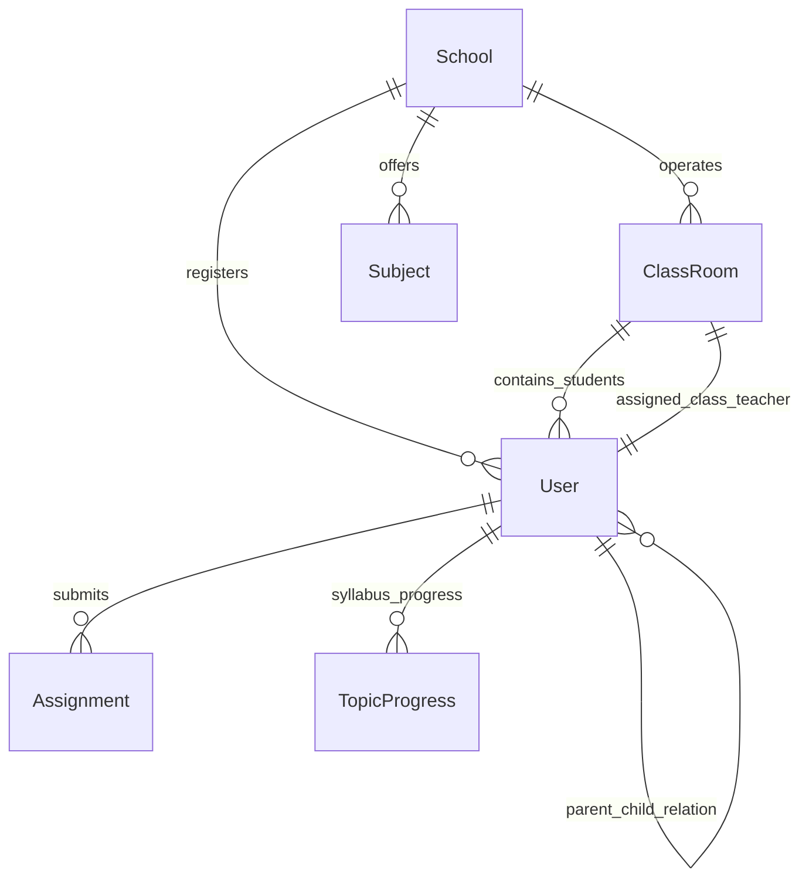

# AI Tutor — Project Context and Architecture Documentation

This document serves as the single source of truth for the **AI Tutor** platform architecture, codebase structure, styling design tokens, database schema, and recent feature updates. Use this context when onboarding new developer agents or planning future feature implementations.

---

## 1. Project Overview & Technology Stack

**AI Tutor** is a multi-tenant, AI-powered educational platform designed for schools, admins, teachers, students, and parents.

* **Frontend Framework**: Next.js 16.2.6 (App Router + Turbopack)
* **Runtime**: React 19.2.4 & ReactDOM 19.2.4
* **Database & ORM**: PostgreSQL database connected via Prisma ORM (`@prisma/client`) with Neon serverless postgres adapter support
* **Authentication**: NextAuth.js (`next-auth`) with custom credentials login and role-based session handling
* **Styling**: Vanilla Tailwind CSS v4 + PostCSS with customized custom glassmorphism style classes
* **State Management**: Zustand store (`src/lib/store.ts`) for managing global client states (e.g. active sidebar tabs, school names, user role states)
* **Animation & Visuals**: Framer Motion for premium micro-animations and transitions; Lottie-Web for vector JSON animations
* **Icons**: Lucide React (`lucide-react`)
* **Toasts**: Sonner (`sonner`)

---

## 2. User Roles & Permission Matrices

The platform handles five distinct user roles defined in `prisma/schema.prisma` via the `Role` enum:

1. **`SUPERADMIN`**:
   - Manages schools (create/update schools, inspect system-wide diagnostics, audit logs).
   - Global dashboard access under `/super-admin/`.
2. **`SCHOOLADMIN`**:
   - Manages classes, sections, subjects, faculty registry, and student directory.
   - Assigns subjects to sections and delegates Class Teachers.
   - Operations reside under `/admin/` (e.g., `/admin/classes`, `/admin/students`, `/admin/teachers`).
3. **`TEACHER`**:
   - Views assigned classes, creates assignments, uploads study materials, posts announcements.
   - Tracks syllabus progress and student quiz performances.
   - Dashboards located under `/teacher/`.
4. **`STUDENT`**:
   - Consumes assignments, completes quizzes, chats with the personalized AI Tutor, accesses ebooks, and schedules study plans.
   - Sidebar contains a collapsible syllabus roadmap tree.
   - Interfaces situated under `/student/`.
5. **`PARENT`**:
   - Monitors their children's grades, syllabus completion rates, and test scores.
   - Direct communication line with teachers.
   - Dashboards placed under `/parent/`.

---

## 3. Database Schema Overview (`prisma/schema.prisma`)

Key database entities and relationships include:



* **User Model**:
  - Contains role, email, password, profile particulars (`phone`, `employeeId`, `primarySubject`), and multi-tenant links (`schoolId`, `classId`, `parentId`).
  - Contains self-relation `ParentChild` (`parentId` mapping to a parent user record, and `children` mapping array of students).
* **ClassRoom Model**:
  - Maps to a single `School`.
  - Defines the specific standard (grade) and section (e.g., standard "8", section "A").
  - Linked to a `classTeacher` (`User` record of role `TEACHER`).
* **Subject Model**:
  - Represents study subjects offered to standard/grades.
  - Topics, chapters, and competencies fall under subjects.

---

## 4. Key Directory Structure

* `/src/app/`: The Next.js App Router root directory.
  - `/src/app/api/`: REST APIs for school dashboard components, resetting passwords, class creation, assigning subjects, and student onboarding.
  - `/src/app/admin/`: Admin console views (classes, student directory, teacher registry, settings).
  - `/src/app/teacher/`: Faculty workspaces.
  - `/src/app/student/`: Student hub including AI Tutor chatbot (`/student/ai-tutor`).
  - `/src/app/parent/`: Parent interface panels.
  - `/src/app/super-admin/`: Superadmin settings and moderation.
* `/src/components/`: Reusable react UI widgets.
  - `layout/`: App Shell wrappers, sidebars, header navigation.
  - `ui/`: Standardized tabs, custom alerts, modal containers.
* `/src/lib/`: Common libraries.
  - `auth.ts`: NextAuth configuration, credentials provider, token callback intercepts.
  - `prisma.ts`: Prisma database client initialization.
  - `store.ts`: Zustand hook store.
* `/prisma/`: Database migration definitions and seeds.

---

## 5. Design Theme and Contrast Rules (Style Guide)

The platform is designed around a high-end, premium **Glassmorphism Theme** that relies heavily on translucent backdrops and subtle borders:

* **Dark Mode**: Uses deep dark-blue and navy gradients (`bg-navy-950`, `bg-black/40`, `border-white/5` border grids).
* **Light Mode (WCAG AA Compliant)**: 
  - Adapts to a soft, modern light aesthetic. Contrast issues have been audited and resolved to meet WCAG AA guidelines.
  - Buttons: Secondary/action buttons use robust dark text contrast (`text-teal-700`, `text-slate-800`) on light translucent cards.
  - Modals & Forms: Form input borders use elevated contrast (`border-black/10` in light theme, `border-white/10` in dark theme). Text options inside select elements use high-contrast foreground states (`text-slate-800` vs `text-white`) to ensure readability.
  - Custom UI elements (`.glass-card`, `.glass-input`, `.glass-button`) have adaptive CSS vars styled inside [globals.css](file:///c:/Users/TECHWING/Downloads/AI%20Tutor/AI%20Tutor/ai-tutor/src/app/globals.css).

---

## 6. Recent Overhauls & Important Implementations

If you are continuing work on this repository, pay close attention to the following recent implementations:

1. **Simultaneous Student & Parent Account Creation**:
   - The "Add Student" modal in [page.tsx](file:///c:/Users/TECHWING/Downloads/AI%20Tutor/AI%20Tutor/ai-tutor/src/app/admin/students/page.tsx) allows admins to input custom passwords and register parent accounts (parent name, email, phone, and password).
   - The API endpoint [route.ts](file:///c:/Users/TECHWING/Downloads/AI%20Tutor/AI%20Tutor/ai-tutor/src/app/api/admin/students/create/route.ts) hashes credentials and automates parent account insertion. If a parent email already exists in the system (e.g. for a sibling), it links the sibling to the existing parent record without duplicate creation.
2. **Global Class Teacher Selection Dropdown**:
   - Inside [page.tsx](file:///c:/Users/TECHWING/Downloads/AI%20Tutor/AI%20Tutor/ai-tutor/src/app/admin/classes/page.tsx), the dropdown to assign class teachers has been fixed to list all school-wide faculty members (`teachers` registry). Previously, it restricted selection strictly to teachers assigned to sections' specific subjects, which caused the dropdown to render empty for empty sections.
3. **Collapsible Syllabus Navigation**:
   - In the student dashboard page, the syllabus navigation panel was updated with smooth collapsible controls to optimize viewport space during chats with the AI Tutor.

---

## 7. Running and Testing Locally

* **Run local development server**:
  ```bash
  npm run dev
  ```
* **Execute TypeScript compiles**:
  ```bash
  npx tsc --noEmit
  ```
* **Verify Next.js production builds**:
  ```bash
  npm run build
  ```
* **Apply Database modifications**:
  ```bash
  npx prisma generate
  npx prisma db push
  ```
